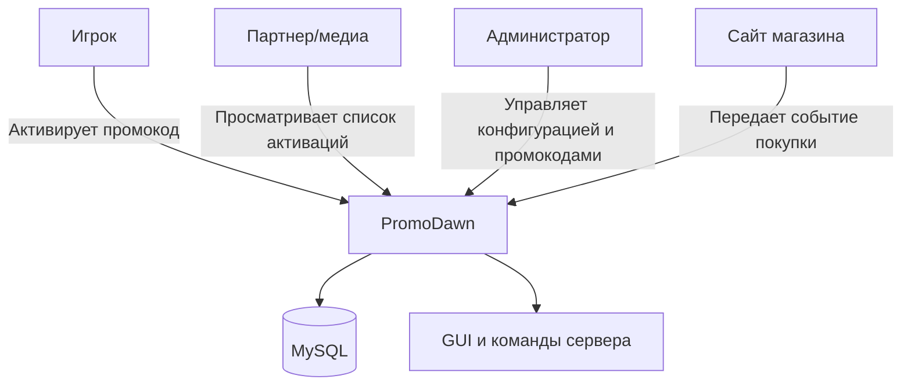
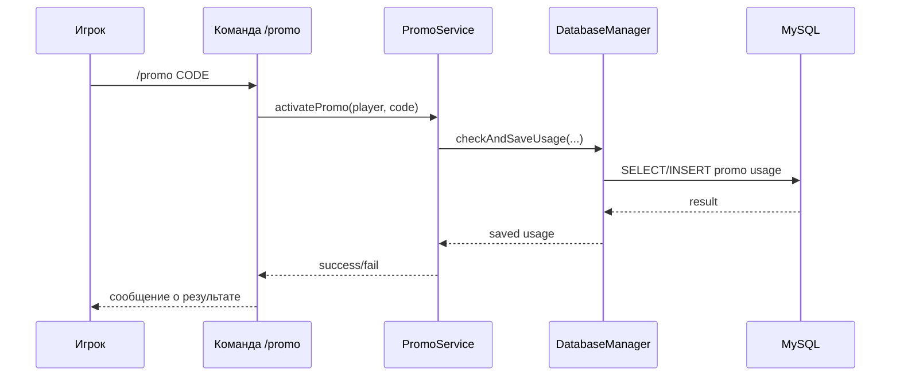

# Отчет по Контрольной точке №1: Проектирование и Старт

**Название проекта:** PromoDawn  
**Команда / Разработчик:** Кудряшов Степан — Minecraft Plugin Developer / QA; Фисенко Роман — Архитектор / Backend-разработчик

### 1. Архитектурный план и концепция

- **Цель сервиса:** PromoDawn — это Minecraft-плагин для управления промокодами и партнерскими привязками игроков. Сервис позволяет игроку активировать промокод партнера на сервере, сохранять связь игрока с партнером и подготавливает архитектурную основу для отображения партнеру информации о покупках игрока на сайте.
- **Целевой интерфейс:** Minecraft server plugin / фоновый серверный модуль
- **Выбранный стек:** Java 8, Maven, Spigot API 1.16.5, MySQL, HikariCP, PlaceholderAPI

### 2. Проектирование (UML-диаграммы)

> Ниже приведены Render-коды диаграмм Mermaid, которые можно визуализировать в GitHub Markdown.

- **Диаграмма вариантов использования (Use Case):**

- **Диаграмма последовательности (Sequence) взаимодействия модулей:**

### 3. Распределение ролей (заполняется, если в команде > 1 человека)

- **Студент 1 (Кудряшов Степан):** Роль: Minecraft Plugin Developer / QA. Зона ответственности: разработка команд и GUI плагина, тестирование игровой логики, проверка сценариев активации промокодов, подготовка интеграции с сервером Minecraft.
- **Студент 2 (Фисенко Роман):** Роль: Архитектор / Backend-разработчик. Зона ответственности: проектирование архитектуры, схема взаимодействия модулей, интеграция с MySQL, подготовка серверной логики для связи плагина с внешним сайтом и будущими событиями покупок.

### 4. Чек-лист готовности (Заполняется студентом: [x] — готово, [ ] — нет)

- [x] Создан новый публичный репозиторий на GitHub.
- [x] Все участники добавлены в репозиторий как соавторы (Collaborators).
- [x] Каждый участник сделал минимум 3 осмысленных коммита (согласно Git-политике).
- [x] Настроено локальное окружение, проект запускается в базовом виде.
